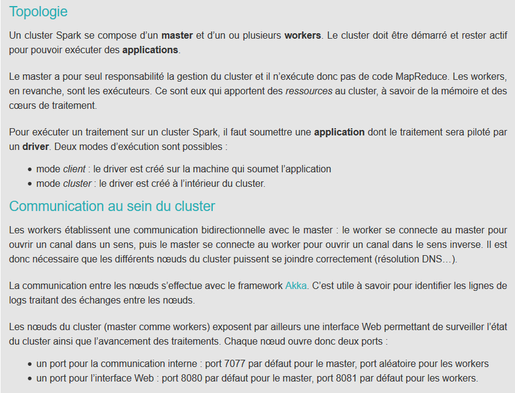

# Tutoriel configuration de deux serveurs

nous allons à travers ce tutoriel aborder la jonction de deux serveurs à distance.
En d'autres terme, deployer une connection entre deux noeuds à l'aide de Spark.

# Les étapes principales

  * configuration des serveurs
  * installation de spark hadoop
  * lancer le noeud master et connecter le noeud worker
  * observez votre cluster (dashboard)
  * lancer un programme qui va s'executer sur les deux noeuds

#### noter qu'il est nécessaire de réaliser les points 1 à 4 sur les deux instances (les deux serveurs) .

# 1) Creer un user sudo sur les deux serveurs qu'on veux connecter

    $ sudo adduser spark
    $ sudo usermod -aG sudo spark #rajout des droits sudo a l'utilisateur spark

# 2) Echanger les clé ssh

    $ infrastructure_as_code/ ./01_00_exchange_keys_linux.sh user@host
    $
    $ # INFORMATIONS ! INFORMATIONS ! INFORMATIONS !
    $ #le script check s'il existe une clé déjà une clé ssh pour votre profil "user",
    $ #si oui, le programme demande un "overwrite", qui n'est pas nécessaire.
    $ #sinon, le script va simplement generer une "clé" ssid , qui va ensuite être
    $ #transmise au serveur distant ( @host ), ainsi qu'un script qui implemente
    $ #un agent ssh Un agent SSH stocke en mémoire les clés privées utilisées lors de
    $ #l'authentification par clef publique (RSA, DSA, ECDSA)
    $ #L'utilisation d'un agent, évite donc d'avoir à retaper la phrase secrète à
    $ #chaque fois que l'on sollicite l'utilisation de la clé privée.
    $
    $ #merci wikipedia

# 3) Prérequis : Java !

    $ #extrait du script infrastructure_as_code/00_00_useful_functions_linux.sh pour installer java8
    $
    $ sudo add-apt-repository ppa:webupd8team/java
    $ sudo apt-get update
    $ sudo apt-get install oracle-java8-installer
    $
    $ #verifier que java s'est bien installé
    $
    $ java -version
    $
    $ # le terminal devrait vous renvoyer la version de JAVA que vous venez d'installer
    $ # il faut maintenant déclarer la variable $HOME dans notre environnement de variables linux,
    $ # pour permettre à spark de lancer sa machine virtuelle dans l'environnement java
    $
    $ export JAVA_HOME=/usr/lib/jvm/java-8-oracle
    $
    $ Voila qui est fait.
    $ #bonus: affichez votre variable  ! inutile, mais bon à savoir
    $ echo $JAVA_HOME

# 4) telechargement de spark hadoop et extraction

    $ #telechargement de l'archive hadoop
    $ wget http://d3kbcqa49mib13.cloudfront.net/spark-2.1.0-bin-hadoop2.7.tgz #telechargement de l'archive

    $ #extraction de l'archive :
    $ tar -xvzf spark-2.1.0-bin-hadoop2.7.tgz

# 5) lancement du master sur notre premier noeud . et lancement du worker sur le deuxieme
  ### SERVEUR 1

    $ #se placer dans le dossier spark
    $ cd spark-2.1.0-bin-hadoop2.7.tgz
    $ sbin/start-master.sh
    $ #rendez vous sur votre navigateur, et allez à l'adresse yourIPadresse:8080 ,
    $ #vous allez voir le dashboard de votre mastere

  ### SERVEUR 2

    $ #Lancement du worker
    $ #toujours faire attention à être dans le dossier spark
    $ cd spark-2.1.0-bin-hadoop2.7.tgz
    $ sbin/start-slave.sh spark://yourIPadresse:7077
    $
    $ #raffraichissez votre navigateur et observez le worker qui s'ajoute à votre dashboard ! :)

# 6) Distribuez le calcul !

    à venir !
    .
